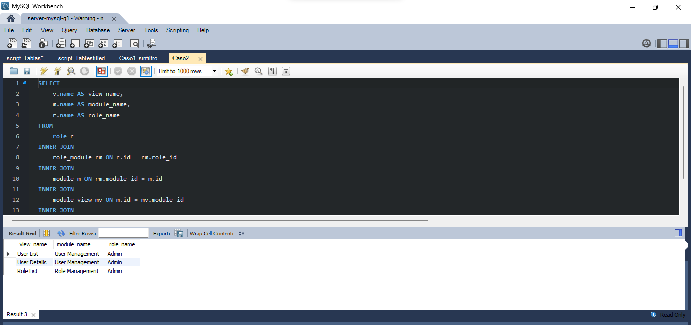

# Caso 2
# **Mostar la lista de vistas a las que tiene acceso un rol. Enviar como condición el nombre del rol [role](name)
---
** Luis Ignacio Bonilla
---
```bash

[role] rol(name)
[module] modulo(name)
[view] vista[name]
```
# Resultado
